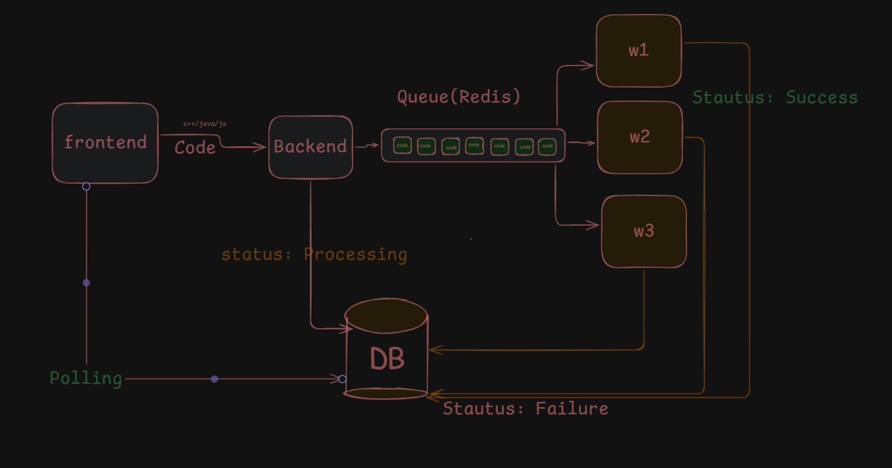

# Code Submission & Execution System — Architecture

## Overview

This system lets a user submit code (C++, Java, JS, etc.) from the frontend, queues it for execution, runs it asynchronously on one of several worker processes, and reports the result back via the database. The frontend never talks to the workers directly — it submits a job and polls the database for status.

